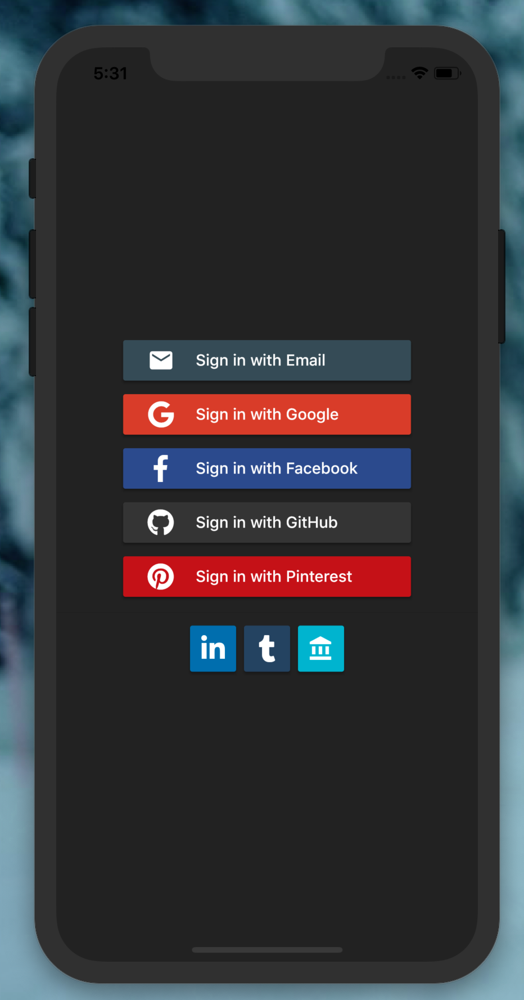

A Flutter plugin for iOS and Android for generating signin buttons for different social media account.

Feedback welcome and Pull Requests are most welcome!

## Installation

Add to pubspec.yaml.

```yaml
dependencies:
  ...
  flutter_signin_button: ^0.1.1
```

## Usage Example

import flutter_signin_button.dart

```dart
import 'package:flutter_signin_button/flutter_signin_button.dart';
```

### For built-in buttons.

```dart
SignInButton(
  Buttons.Google,
  onPressed: () {},
)
```

### For mini buttons.

```dart
SignInButton(
  Buttons.Facebook,
  mini: true,
  onPressed: () {},
)
```

### For self-build buttons.

```dart
SignInButtonBuilder(
  title: 'Email',
  icon: Icons.email,
  onPressed: () {},
  backgroundColor: Colors.blueGrey[700],
)
```

### Built-in Buttons contain

```dart
enum Buttons {
  Email,
  Google,
  Facebook,
  GitHub,
  LinkedIn,
  Pinterest,
  Tumblr,
}
```

## A Complete Example

```dart
import 'package:flutter/material.dart';
import 'package:flutter_signin_button/flutter_signin_button.dart';

void main() => runApp(MyApp());

class MyApp extends StatelessWidget {
  @override
  Widget build(BuildContext context) {
    return MaterialApp(
      title: 'Flutter Demo',
      theme: ThemeData.light(),
      home: LoginPage(),
      debugShowCheckedModeBanner: false,
    );
  }
}

class LoginPage extends StatelessWidget {
  @override
  Widget build(BuildContext context) {
    return Scaffold(
      backgroundColor: Color.fromRGBO(50, 50, 50, 1.0),
      body: Center(
        child: Column(
          mainAxisAlignment: MainAxisAlignment.center,
          children: <Widget>[
            SignInButtonBuilder(
              title: 'Email',
              icon: Icons.email,
              onPressed: () {},
              backgroundColor: Colors.blueGrey[700],
            ),
            SignInButton(
              Buttons.Google,
              onPressed: () {},
            ),
            SignInButton(
              Buttons.Facebook,
              onPressed: () {},
            ),
            SignInButton(
              Buttons.GitHub,
              onPressed: () {},
            ),
            SignInButton(
              Buttons.Pinterest,
              onPressed: () {},
            ),
            Divider(),
            Row(
              mainAxisAlignment: MainAxisAlignment.center,
              children: <Widget>[
                SignInButton(
                  Buttons.LinkedIn,
                  mini: true,
                  onPressed: () {},
                ),
                SignInButton(
                  Buttons.Tumblr,
                  mini: true,
                  onPressed: () {},
                ),
                SignInButtonBuilder(
                  icon: Icons.account_balance,
                  mini: true,
                  onPressed: () {},
                  backgroundColor: Colors.cyan,
                ),
              ],
            ),
          ],
        ),
      ),
    );
  }
}
```



**Refer to example folder and the source code for more information.**
